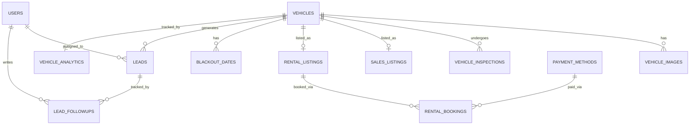

# Soulani Auto Garage - Product & Technical Architecture

*A Principal Architecture Review & Refinement*

**Objective:** Transform the conceptual architecture into a robust, scalable, and production-ready system while strictly defining an achievable MVP. Unnecessary complexities have been deferred, and operational realities (inspections, role-based access, lead management) have been prioritized.

**Target Market & Currency:** The entire platform is built for the Indonesian market. All transactions, prices, and dashboard metrics are denominated in **Indonesian Rupiah (IDR)**. Payment systems are tailored for popular Indonesian channels (e.g., Virtual Accounts, bank transfers, QRIS, and e-wallets).

---

## 1. Improved Sitemap

### Public Facing (Customer Portal)
- **Home** (`/`) — Dynamic Hero, Featured Sales, New Arrivals, Body Type categories, Testimonials
- **Mobil Dijual** (`/sales`)
  - Search & Browse with URL-synchronized filters
  - Vehicle Detail Page (`/sales/[slug]`) — Gallery, Specs, Inspection Report, Inquiry Form (ACTIVE vehicles only)
- **Sewa Mobil** (deferred — Phase 4)
  - Search & Availability Calendar
  - Rental Fleet
  - Rental Details Page (Rates, terms, Guest Checkout flow)
- **Tentang Kami** (`/tentang-kami`) — Our Story & Showroom (static for Phase 3; CMS-managed from Phase 6)
- **Kontak** (`/kontak`) — Map, hours, direct messaging, WhatsApp link (static for Phase 3; CMS-managed from Phase 6)
- **Legal** (Privacy Policy, Terms of Service, Rental Agreement)

*(Note: Customer Portal/Dashboard is deferred to Phase 1.5)*

---

## 2. Updated User Journey

### Journey A: Used Car Buyer (Sales Flow)
1. **Awareness:** Lands on the Vehicle Detail Page (VDP) via `/sales/[slug]`.
2. **Status Check (Crucial):** If the vehicle status is `SOLD` or `MAINTENANCE`, the CTA area is replaced with a "Pendaftaran Ditutup" (Inquiry Closed) panel. The inquiry form is **not rendered**.
3. **Action (ACTIVE vehicles only):** Fills out the Inquiry Form (Sales Inquiry, Test Drive, or Make Offer). The `MAKE_OFFER` type reveals a conditional "Offered Price (IDR)" field.
4. **CRM Logging (Crucial):** System **immediately** saves the lead into the CRM and generates a unique Lead ID (`LD-YYYY-XXXXX`).
5. **WhatsApp Redirect:** *Only after* the lead is successfully saved, the customer is shown a success state with their Ref ID and a button to open WhatsApp with a pre-filled message.
6. **Nurture & Close:** Sales staff tracks the lead through the CRM stages (`NEW → CONTACTED → NEGOTIATING → TEST_DRIVE_SCHEDULED → WON/LOST`).

### Journey B: Rental Customer (Short-Term vs Long-Term)
1. **Search & Selection:** Enters dates. The system identifies if the request is **Short-Term (1-7 days)** or **Long-Term (>7 days)**.
2. **Short-Term Flow (Direct Booking):**
   - Customer selects dates and books directly online.
   - Uploads required documents (ID/License).
   - Receives Admin-configured offline payment instructions (e.g., bank transfer to local Indonesian bank accounts such as BCA or Mandiri).
   - Booking enters `PENDING_PAYMENT` flow.
3. **Long-Term Flow (Quote & Negotiation):**
   - Customer can submit a booking request OR request a custom quote via WhatsApp.
   - Admin can issue custom pricing.
   - System tracks the negotiation until a finalized rate is approved.

---

## 3. Improved Feature List

### MVP (Phase 1) — ✅ Complete
- **Infrastructure:** Turborepo monorepo, Prisma schema & migrations, Local MySQL via Laragon, JWT Auth, Users/Staff API.

### MVP (Phase 2) — ✅ Complete
- **Advanced Inventory:** Vehicle CRUD with mandatory image upload (Multer, multipart/form-data), Featured/New Arrival tags, detailed vehicle data (Plate, Chassis, Engine No, Mileage, Transmission, Fuel Type, Body Type).
- **Inspection Module:** Standardized inspection checklists for all vehicles (8 component statuses: Engine, Transmission, Suspension, Electrical, AC, Tires, Interior, Exterior).
- **Sales & Rental Listing Configuration:** Pricing, deposit, and long-term eligibility settings.

### MVP (Phase 3) — ✅ Complete
- **Public Website & CMS:** Dynamic homepage (SSG+ISR, hourly revalidate), SEO-optimized sales inventory listings, dynamic testimonials.
- **Sales Listing Page:** Client-side filter state with URL synchronization (`?search`, `?carType`, `?transmission`, `?fuelType`, `?minPrice`, `?maxPrice`, `?sort`, `?isFeatured`, `?isNewArrival`). Dual-section layout: "Unit Tersedia" (ACTIVE) and "Baru Saja Terjual / Dalam Perawatan" (SOLD/MAINTENANCE).
- **Vehicle Detail Page (VDP):** SSG per slug (`revalidate: 1800s`), JSON-LD structured data, status-conditional inquiry form, ViewTracker analytics.
- **Lead Inquiry Form:** Full Zod validation, conditional `offeredPrice` field for `MAKE_OFFER` type, WhatsApp redirect success state.
- **`POST /leads` API:** Rate-limited (10/IP/hour), generates `LD-YYYY-XXXXX` reference ID, returns `whatsappRedirectUrl`.
- **Analytics View Tracking:** `POST /analytics/vehicles/:id/track-view` (public, fire-and-forget).
- **Static Pages:** `/tentang-kami` and `/kontak` with static dummy content (CMS-ready for Phase 6).
- **Prisma Seed:** `HomepageContent` and `Testimonials` seeded with defaults.

### Phase 4 — ⚪ Planned
- **Rental Engine:** Rental Listing page, Availability & Blackout Dates API, Rental Booking flow & Guest Checkout, >7 Day custom quote via Lead flow, Admin booking status management.

### Phase 1.5
- **Customer Portal:** Account creation, booking history tracking, saved vehicles.

### Phase 2 (Product)
- **Advanced Tools:** 360° Vehicle Viewer, Financing Calculator.
- **Online Payments:** Automated Indonesian Payment Gateway integration (e.g., Midtrans or Xendit supporting QRIS, Bank Virtual Accounts, and E-Wallets).

---

## 4. Updated Admin Dashboard Specification

### Role-Based Access Control (RBAC)
1. **Super Admin (Owner):** Full access to all modules, system settings, APIs, audit logs, and the Owner Analytics Dashboard.
2. **Sales Staff:** Access to Sales Inventory, Inspection Module, Sales Leads, and Testimonials. Can only view assigned leads.
3. **Rental Staff:** Access to Rental Fleet, Rental Bookings, Calendar, and Payments Verification.

### Owner Dashboard (Analytics Overview)
The Super Admin lands on a high-level analytics view containing:
- Total Available Cars
- Cars Sold This Month
- Active Rentals & Upcoming Rental Returns
- Rental Revenue
- Sales Leads vs Rental Leads
- Lead Conversion Rate
- Most Viewed Vehicles

### Core Modules
- **Vehicle Manager:** Add/Edit inventory. Configure VIN, Plate, Chassis. Toggle tags (Featured, New Arrival). Manage vehicle status (`DRAFT → ACTIVE → SOLD/MAINTENANCE`). Publish via `PATCH /vehicles/:id/publish`.
- **Inspection Manager:** Log reports (Engine, Transmission, Suspension, Electrical, AC, Tires, Interior, Exterior) with dates, inspector name, and notes.
- **Booking & Calendar:** Visual calendar of rentals. Manage statuses (Pending, Active, Completed, Overdue). Set blackout dates.
- **Lead CRM:** Kanban board for lead stages. Add follow-up notes and reassign leads.
- **CMS Manager:** Update Hero banners, promos, and publish/archive Testimonials.
- **Payment Settings:** Configure manual payment methods and instructions (e.g., Bank Transfer details for BCA, Mandiri, or other local accounts).

---

## 5. Complete Database Entity List

*All tables include standard production columns: `created_at`, `updated_at`, `deleted_at` (Soft Delete), and `created_by_id`.*

1. **`users` (Admin/Staff)**
   - `id`, `uuid`, `name`, `email`, `password_hash`, `role` (`SUPER_ADMIN`, `SALES_STAFF`, `RENTAL_STAFF`), `is_active`.

2. **`vehicles`**
   - `id`, `slug`, `make`, `model`, `year`, `car_type` (Enum: `SUV`, `MPV`, `HATCHBACK`, `SEDAN`, `COUPE`, `CONVERTIBLE`, `WAGON`, `PICKUP`, `VAN`, `CROSSOVER`), `color`, `vin` (unique, nullable), `plate_number` (unique, nullable), `chassis_number` (unique, nullable), `engine_number` (unique, nullable), `listing_type` (Enum: `SALE`, `RENTAL`, `BOTH`), `status` (Enum: `DRAFT`, `ACTIVE`, `SOLD`, `RENTED`, `MAINTENANCE`), `is_featured`, `is_new_arrival`.
   - **Rich Vehicle Fields:** `mileage` (Int), `transmission` (Enum: `MANUAL`, `AUTOMATIC`, `CVT`), `fuel_type` (Enum: `GASOLINE`, `DIESEL`, `HYBRID`, `ELECTRIC`), `description` (Text).
   - **SEO:** `meta_title`, `meta_description` (Text).

3. **`vehicle_images`**
   - `id`, `vehicle_id`, `file_url` (absolute URL for rendering; computed on API response), `file_path` (unique relative path on disk; stored in DB), `is_primary`, `sort_order`.
   - *Note: `file_url` and `file_path` replace the previously planned `cloudinary_url` / `cloudinary_public_id` fields. The `file_url` is computed by the API at response time by prepending the server base URL to `file_path`. This structure is forward-compatible with Cloudinary migration (Phase 7).*

4. **`vehicle_inspections`**
   - `id`, `vehicle_id`, `inspection_date`, `inspector_name`, `engine_status`, `transmission_status`, `suspension_status`, `electrical_status`, `ac_status`, `tires_status`, `interior_status`, `exterior_status`, `general_notes`.
   - All status fields use Enum: `PASS`, `FAIL`, `NEEDS_ATTENTION`.

5. **`sales_listings`** & **`rental_listings`**
   - *Sales:* `id`, `vehicle_id` (unique), `price` (Decimal 15,2 in IDR), `previous_owners`.
   - *Rental:* `id`, `vehicle_id` (unique), `daily_rate` (Decimal 15,2 in IDR), `weekly_rate` (optional), `deposit_amount`, `is_long_term_eligible`.

6. **`leads`**
   - `id`, `lead_reference_id` (unique; format: `LD-YYYY-XXXXX`), `vehicle_id`, `assigned_to_id` (user_id), `customer_name`, `customer_phone`, `customer_email` (optional), `type` (Enum: `SALES_INQUIRY`, `TEST_DRIVE_REQUEST`, `MAKE_OFFER`, `RENTAL_INQUIRY`, `LONG_TERM_QUOTE`), `offered_price` (optional), `source` (Enum: `ORGANIC`, `GOOGLE_ADS`, `FACEBOOK`, `INSTAGRAM`, `DIRECT`, `WHATSAPP`, `REFERRAL`), `status` (Enum: `NEW`, `CONTACTED`, `NEGOTIATING`, `TEST_DRIVE_SCHEDULED`, `WON`, `LOST`), `message` (optional Text).

7. **`lead_followups`**
   - `id`, `lead_id`, `user_id`, `note_text`, `interaction_date`.

8. **`rental_bookings`**
   - `id`, `rental_listing_id`, `customer_name`, `customer_phone`, `customer_email`, `identity_number` (optional), `license_image_url` (optional), `proof_of_transfer_url` (optional), `start_date`, `end_date`, `payment_method_id`, `total_price`, `status` (Enum: `PENDING_PAYMENT`, `CONFIRMED`, `ACTIVE`, `COMPLETED`, `CANCELLED`, `OVERDUE`), `whatsapp_opt_in`.

9. **`blackout_dates`**
   - `id`, `vehicle_id`, `start_date`, `end_date`, `reason` (Enum: `MAINTENANCE`, `ADMIN_BLOCK`).

10. **`vehicle_analytics`**
    - `id`, `vehicle_id` (unique), `view_count`, `inquiry_count`, `offer_count`, `rental_request_count`, `last_updated`.

11. **`audit_logs`**
    - `id`, `user_id` (no FK constraint — intentional for archivability), `action` (Enum: `CREATE`, `UPDATE`, `DELETE`, `RESTORE`), `module_name`, `record_id`, `previous_value` (JSON), `new_value` (JSON), `timestamp`.

12. **`payment_methods`**, **`testimonials`**, **`homepage_content`**
    - Standard configuration and CMS tables. `homepage_content` uses a key-value JSON store (e.g., keys: `whatsapp_number`, `hero_headline`, `about_story`, etc.) managed via the CMS module from Phase 6.

---

## 6. Entity Relationship Diagram (ERD)



---

## 7. Production-Ready API Architecture

### Security & Access
- **Authentication:** JWT (JSON Web Tokens) with short-lived access tokens (15m) and HttpOnly secure refresh tokens (7d).
- **Authorization:** Middleware strictly enforcing RBAC on all admin routes.
- **API Security:** Helmet (with `crossOriginResourcePolicy: { policy: 'cross-origin' }` for local image serving), strict CORS, and `@nestjs/throttler` rate-limiting on public lead/booking endpoints to prevent spam.

### Image Architecture (Local Storage / Multer)
- **Do not store base64 in database.**
- **Upload Workflow:**
  1. Admin creates a vehicle via `POST /vehicles` using `multipart/form-data`. The request body contains a `data` field (JSON string with vehicle details) and up to 10 image `files`.
  2. NestJS intercepts files using `FilesInterceptor` (Multer), validates extension (`.jpg`, `.jpeg`, `.png`, `.webp`, `.jfif`) and size (≤5MB), generates a 32-char hex random filename, and saves files locally under `apps/api/uploads/vehicles/`.
  3. NestJS saves the local relative path (e.g., `uploads/vehicles/filename.jpg`) to the `vehicle_images.file_path` column. The API response computes and returns `imageUrl` (absolute URL) by prepending the server base URL.
- **Folder Structure on Local Disk:** `apps/api/uploads/vehicles/`, `apps/api/uploads/licenses/`, `apps/api/uploads/testimonials/`.
- **Future Migration:** In Phase 7 (Production Launch), this can be swapped to Cloudinary for global CDN caching and optimization. The `file_path`/`file_url` column pair is forward-compatible with this migration.

### Data Integrity & Audit Trail API
- **Audit Logging Interceptor:** Every write operation (POST/PATCH/DELETE) routes through an `AuditInterceptor`.
- **Payload Capture:** The system captures the `user_id`, the `action` type, the `module`, and a JSON diff of `previous_value` and `new_value`, appending a strict server `timestamp`.
- **Soft Deletes:** `deleted_at` timestamp ensures no accidental permanent data loss.
- **Restore Endpoint:** `POST /vehicles/:id/restore` is available for Super Admin to un-delete a soft-deleted record.

## 7.5 Updated Analytics Requirements
- **Vehicle Analytics API:** Specialized endpoints to aggregate and increment `view_count`, `inquiry_count`, `offer_count`, and `rental_request_count` asynchronously to prevent blocking the main thread.
- **Owner Dashboard Aggregation:** Complex SQL views/queries to generate realtime metrics (Revenue, Lead Conversion Rate, Upcoming Returns) for the Super Admin dashboard without degrading transactional database performance.

---

## 8. Actual Folder Structure (As Implemented)

```text
soulani-auto-garage/          # Turborepo monorepo root
├── apps/
│   ├── web/                  # Next.js 15 Frontend (Vercel)
│   │   └── src/
│   │       ├── app/
│   │       │   ├── (public)/ # Route group: public pages (no auth)
│   │       │   │   ├── page.tsx          # Homepage
│   │       │   │   ├── layout.tsx        # Public layout (Navbar, Footer, WhatsAppFAB)
│   │       │   │   ├── sales/
│   │       │   │   │   ├── page.tsx      # Sales Listing (client, URL-synced filters)
│   │       │   │   │   └── [slug]/page.tsx  # Vehicle Detail (SSG + ISR)
│   │       │   │   ├── tentang-kami/     # About Us (static)
│   │       │   │   └── kontak/           # Contact (static)
│   │       │   ├── (admin)/              # Route group: protected admin
│   │       │   │   └── admin/
│   │       │   │       ├── layout.tsx    # AdminLayout — enforces JWT + RBAC
│   │       │   │       ├── dashboard/page.tsx
│   │       │   │       └── inventory/    # (add, edit sub-routes)
│   │       │   ├── login/page.tsx
│   │       │   ├── layout.tsx            # Root layout (fonts, globals.css)
│   │       │   └── globals.css           # Shadcn + Tailwind v4 tokens
│   │       ├── components/
│   │       │   ├── ui/                   # Shadcn base components (base-vega style)
│   │       │   ├── vehicles/             # VehicleCard, VehicleGallery, VehicleBadge, InspectionReportCard, VehicleFilters, VehicleGrid, VehicleSpecGrid, PriceDisplay
│   │       │   ├── leads/                # InquiryForm, InquirySheet, InquiryModal, LeadSuccessState
│   │       │   ├── rental/               # (Phase 4)
│   │       │   ├── admin/                # DataTable, StatsCard, KanbanBoard
│   │       │   └── shared/               # Navbar, Footer, WhatsAppFAB, SkeletonCard, Breadcrumb, EmptyState, SectionHeader
│   │       ├── lib/
│   │       │   ├── api.ts                # Typed fetch client (base URL, error handling, session expiry)
│   │       │   ├── whatsapp.ts           # buildVehicleWhatsAppUrl(), buildGenericWhatsAppUrl()
│   │       │   ├── images.ts             # Image URL helpers
│   │       │   └── utils.ts              # formatIDR, vehicleDisplayName, LEAD_TYPE_LABELS, getInitials, getAvatarColor, cn
│   │       ├── hooks/
│   │       ├── store/
│   │       │   └── auth.store.ts         # Zustand — accessToken, user, role
│   │       └── types/
│   │           └── api.types.ts          # Shared TypeScript interfaces (mirrors schema.prisma)
│   │
│   └── api/                  # NestJS Backend (Railway)
│       ├── src/
│       │   ├── main.ts                   # Bootstrap: helmet, CORS, ValidationPipe, versioning
│       │   ├── app.module.ts
│       │   ├── auth/
│       │   ├── vehicles/                 # Handles multipart/form-data upload inline
│       │   ├── vehicle-images/
│       │   ├── vehicle-inspections/
│       │   ├── sales-listings/
│       │   ├── rental-listings/
│       │   ├── listings/                 # Combined listing queries (public listing page)
│       │   ├── rental-bookings/
│       │   ├── blackout-dates/
│       │   ├── leads/
│       │   ├── lead-followups/
│       │   ├── testimonials/
│       │   ├── cms/
│       │   ├── analytics/
│       │   ├── users/
│       │   ├── cloudinary/               # Stub module — reserved for Phase 7
│       │   ├── common/
│       │   │   ├── guards/               # JwtAuthGuard, RolesGuard, OwnershipGuard
│       │   │   ├── interceptors/         # AuditInterceptor, TransformInterceptor
│       │   │   ├── decorators/           # @Roles(), @Public()
│       │   │   └── filters/              # HttpExceptionFilter, PrismaExceptionFilter
│       │   └── prisma/
│       ├── prisma/
│       │   ├── schema.prisma
│       │   └── migrations/
│       └── uploads/
│           ├── vehicles/
│           ├── licenses/
│           └── testimonials/
│
├── packages/
│   ├── types/                # Shared TypeScript interfaces (cross-app)
│   └── utils/                # Shared utility functions (IDR formatter, WhatsApp builder, date helpers)
│
├── docs/                     # All project documentation
├── turbo.json                # Turborepo pipeline config
└── pnpm-workspace.yaml
```

---

## 9. Development Roadmap

### Phase 1: Foundation — ✅ Completed
**Goal:** Establish local infrastructure and authentication backbone.
- Turborepo monorepo setup, Prisma schema migration, Local MySQL via Laragon, JWT Auth, Users/Staff API, Next.js + NestJS running concurrently.

### Phase 2: Inventory Management — ✅ Completed
**Goal:** Full vehicle inventory management for admins.
- Vehicle CRUD API + Admin UI, multipart/form-data image upload (Multer), Inspection report form + API, Sales & Rental Listing configuration.

### Phase 3: Public Website & Sales Flow — ✅ Completed
**Goal:** Customer-facing website with CRM-backed lead capture.
- Homepage (SSG + ISR), Sales Listing page (URL-synchronized filters, dual ACTIVE/archived sections), Vehicle Detail page (SSG + ISR, JSON-LD, status-conditional CTA), Lead Inquiry Form, `POST /leads` API with WhatsApp redirect, `GET /vehicles/by-slug/:slug` public endpoint, View tracking, Rate limiting, Prisma seed for Testimonials + HomepageContent.

### Phase 4: Rental Flow — ⚪ Planned
**Goal:** Full rental booking and long-term quote experience.
- Rental Listing page, Availability & Blackout Dates API, Rental Booking flow & Guest Checkout, >7 Day custom quote, Admin booking status management.

### Phase 5: CRM & Operations — ⚪ Planned
**Goal:** CRM for staff to track leads and assignments.
- Sales Leads CRM Board (Kanban), Lead Assignment, Lead Followups API & UI, Long-Term Rental Quote management, Audit logs.

### Phase 6: Analytics & CMS — ⚪ Planned
**Goal:** Analytics dashboard for the owner and content management.
- Owner Analytics Dashboard, CMS API & Admin UI for Homepage content, Admin-managed WhatsApp number (from `HomepageContent` table), Testimonial photo upload, FAQ management.

### Phase 7: Production Launch — ⚪ Planned
**Goal:** Harden, optimize, and deploy to the cloud.
- CI/CD pipeline (Vercel/Railway), cloud infrastructure provisioning, rate limiting hardening, mobile QA, Lighthouse ≥ 90, SSL + custom domain, Cloudinary migration.

> [!TIP]
> **Future Phases (Post-Launch)**
> - Phase 8: Indonesian Payment Gateway (Midtrans/Xendit) — QRIS, Virtual Accounts, E-Wallets
> - Phase 9: Customer Portal — account creation, booking history, saved vehicles
> - Phase 10: 360° Vehicle Viewer + IDR Financing Calculator
> - Phase 11: Advanced Analytics, SMS/WhatsApp fleet maintenance alerts
