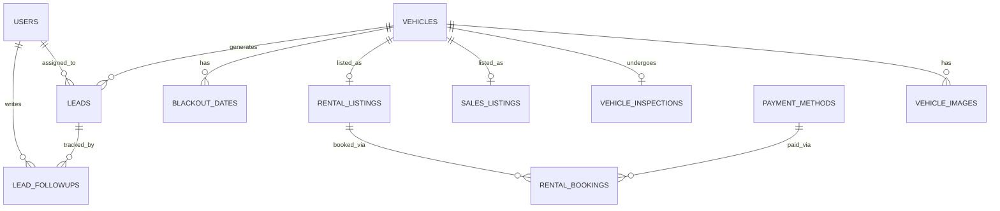

# Soulani Auto Garage - Product & Technical Architecture

*A Principal Architecture Review & Refinement*

**Objective:** Transform the conceptual architecture into a robust, scalable, and production-ready system while strictly defining an achievable MVP. Unnecessary complexities have been deferred, and operational realities (inspections, role-based access, lead management) have been prioritized.

**Target Market & Currency:** The entire platform is built for the Indonesian market. All transactions, prices, and dashboard metrics are denominated in **Indonesian Rupiah (IDR)**. Payment systems are tailored for popular Indonesian channels (e.g., Virtual Accounts, bank transfers, QRIS, and e-wallets).

---

## 1. Improved Sitemap

### Public Facing (Customer Portal)
- **Home** (Dynamic Hero, Featured Sales, New Arrivals, Promos, Testimonials)
- **Cars for Sale**
  - Search & Browse
  - Car Details Page (Gallery, Specs, Inspection Report, Negotiation Form)
- **Car Rental**
  - Search & Availability Calendar
  - Rental Fleet
  - Rental Details Page (Rates, terms, Guest Checkout flow)
- **Services/About Us**
  - Our Story & Showroom
  - Trust & Quality Guarantee
- **Contact Us** (Map, hours, direct messaging, WhatsApp link)
- **Legal** (Privacy Policy, Terms of Service, Rental Agreement)

*(Note: Customer Portal/Dashboard is deferred to Phase 1.5)*

---

## 2. Updated User Journey

### Journey A: Used Car Buyer (Sales Flow)
1. **Awareness:** Lands on the Vehicle Detail Page.
2. **Action:** Fills out an Inquiry Form (Sales Inquiry, Test Drive, or Make Offer).
3. **CRM Logging (Crucial):** System **immediately** saves the lead into the CRM and generates a unique Lead ID.
4. **WhatsApp Redirect:** *Only after* the lead is successfully saved, the customer is redirected to WhatsApp with a pre-filled message containing their details and Lead ID.
5. **Nurture & Close:** Sales staff tracks the lead through the CRM stages.

### Journey B: Rental Customer (Short-Term vs Long-Term)
1. **Search & Selection:** Enters dates. The system identifies if the request is **Short-Term (1-7 days)** or **Long-Term (>7 days)**.
2. **Short-Term Flow (Direct Booking):**
   - Customer selects dates and books directly online.
   - Uploads required documents (ID/License).
   - Receives Admin-configured offline payment instructions (e.g., bank transfer to local Indonesian bank accounts such as BCA or Mandiri).
   - Booking enters `Payment Verification` flow.
3. **Long-Term Flow (Quote & Negotiation):**
   - Customer can submit a booking request OR request a custom quote via WhatsApp.
   - Admin can issue custom pricing.
   - System tracks the negotiation until a finalized rate is approved.

---

## 3. Improved Feature List

### MVP (Phase 1)
- **Public Website & CMS:** Dynamic homepage, SEO-optimized inventory listings, dynamic testimonials.
- **Advanced Inventory:** Featured/New Arrival tags, detailed vehicle data (Plate, Chassis, Engine No).
- **Inspection Module:** Standardized inspection checklists for all vehicles.
- **Rental Engine:** Availability calendar, blackout dates, guest checkout, manual payment instructions.
- **Lead CRM:** Source tracking, staff assignment, stage tracking (New to Won/Lost).
- **Local File Storage (Multer):** Local upload workflow, serving assets via NestJS (Cloudinary integration deferred to production).
- **RBAC Admin:** Role-based dashboard (Super Admin, Sales, Rental).

### Phase 1.5
- **Customer Portal:** Account creation, booking history tracking, saved vehicles.

### Phase 2
- **Advanced Tools:** 360° Vehicle Viewer, Financing Calculator.
- **Online Payments:** Automated Indonesian Payment Gateway integration (e.g., Midtrans or Xendit supporting QRIS, Bank Virtual Accounts, and E-Wallets).

---

## 4. Updated Admin Dashboard Specification

### Role-Based Access Control (RBAC)
1. **Super Admin (Owner):** Full access to all modules, system settings, APIs, audit logs, and the Owner Analytics Dashboard.
2. **Sales Staff:** Access to Sales Inventory, Inspection Module, Sales Leads, and Testimonials. Can only view assigned leads.
3. **Rental Staff:** Access to Rental Fleet, Rental Bookings, Calendar, and Payments Verification.

### Owner Dashboard (Analytics Overview)
The Super Admin lands on a high-level analytics view containing:
- Total Available Cars
- Cars Sold This Month
- Active Rentals & Upcoming Rental Returns
- Rental Revenue
- Sales Leads vs Rental Leads
- Lead Conversion Rate
- Most Viewed Vehicles

### Core Modules
- **Vehicle Manager:** Add/Edit inventory. Configure VIN, Plate, Chassis. Toggle tags (Featured, Highlighted).
- **Inspection Manager:** Log reports (Engine, EV/Hybrid system, AT/MT, Suspension, AC, Tires, Interior, Exterior) with dates and notes.
- **Booking & Calendar:** Visual calendar of rentals. Manage statuses (Pending, Active, Completed, Overdue). Set blackout dates.
- **Lead CRM:** Kanban board for lead stages. Add follow-up notes and reassign leads.
- **CMS Manager:** Update Hero banners, promos, and publish/archive Testimonials.
- **Payment Settings:** Configure manual payment methods and instructions (e.g., Bank Transfer details for BCA, Mandiri, or other local accounts).

---

## 5. Complete Database Entity List

*All tables include standard production columns: `created_at`, `updated_at`, `deleted_at` (Soft Delete), and `created_by`.*

1. **`users` (Admin/Staff)**
   - `id`, `uuid`, `name`, `email`, `password_hash`, `role` (super_admin, sales, rental), `is_active`.
2. **`vehicles`**
   - `id`, `slug`, `make`, `model`, `year`, `color`, `vin` (null), `plate_number` (null), `chassis_number` (null), `engine_number` (null), `type` (sale, rental, both), `status` (available, sold, rented, maintenance), `is_featured`, `is_new_arrival`.
   - *SEO:* `meta_title`, `meta_description`.
3. **`vehicle_images`**
   - `id`, `vehicle_id`, `cloudinary_url` (stores local relative path), `cloudinary_public_id` (used for local unique identifiers), `is_primary`, `sort_order`.
4. **`vehicle_inspections`**
   - `id`, `vehicle_id`, `inspection_date`, `inspector_name`, `engine_status`, `transmission_status`, `suspension_status`, `electrical_status`, `ac_status`, `tires_status`, `interior_status`, `exterior_status`, `general_notes`.
5. **`sales_listings`** & **`rental_listings`**
   - *Sales:* `id`, `vehicle_id`, `price` (Decimal in IDR), `previous_owners`.
   - *Rental:* `id`, `vehicle_id`, `daily_rate` (Decimal in IDR), `weekly_rate` (Decimal in IDR), `deposit_amount` (Decimal in IDR), `is_long_term_eligible`.
6. **`leads`**
   - `id`, `lead_reference_id` (Generated ID for WhatsApp), `vehicle_id`, `assigned_to` (user_id), `customer_name`, `customer_phone`, `type` (Sales Inquiry, Test Drive Request, Make Offer, Rental Inquiry, Long-Term Rental Quote Request), `offered_price`, `source`, `status`.
7. **`lead_followups`**
   - `id`, `lead_id`, `user_id`, `note_text`, `interaction_date`.
8. **`rental_bookings`**
   - `id`, `rental_listing_id`, `customer_name`, `customer_phone`, `customer_email`, `license_image_url`, `start_date`, `end_date`, `payment_method_id`, `total_price`, `status` (Pending Payment, Confirmed, Active, Completed, Cancelled, Overdue), `whatsapp_opt_in`.
9. **`blackout_dates`**
   - `id`, `vehicle_id`, `start_date`, `end_date`, `reason` (maintenance, admin_block).
10. **`vehicle_analytics`**
    - `id`, `vehicle_id`, `view_count`, `inquiry_count`, `offer_count`, `rental_request_count`, `last_updated`.
11. **`audit_logs`**
    - `id`, `user_id`, `action`, `module_name`, `record_id`, `previous_value` (JSON), `new_value` (JSON), `timestamp`.
12. **`payment_methods`** & **`testimonials`** & **`homepage_content`**
    - Standard configuration and CMS tables.

---

## 6. Entity Relationship Diagram (ERD)



---

## 7. Production-Ready API Architecture

### Security & Access
- **Authentication:** JWT (JSON Web Tokens) with short-lived access tokens and HttpOnly secure refresh tokens.
- **Authorization:** Middleware strictly enforcing RBAC (Role-Based Access Control) on all admin routes.
- **API Security:** Helmet for security headers, strict CORS policies, and rate-limiting on public lead/booking endpoints to prevent spam.

### Image Architecture (Local Storage / Multer)
- **Do not store base64 in database.** 
- **Upload Workflow:** 
  1. Frontend uploads files directly to the NestJS API (using multipart/form-data).
  2. NestJS intercepts files using Multer, generates unique file names, and saves files locally under `/uploads/`.
  3. NestJS saves the local relative URL (e.g., `/uploads/vehicles/filename.jpg`) to the database (`cloudinaryUrl` field will store the local path for seamless future migration).
- **Folder Structure on Local Disk:** `apps/api/uploads/vehicles/`, `apps/api/uploads/licenses/`, `apps/api/uploads/testimonials/`.
- **Future Migration:** In Phase 7 (Production Launch), this can be swapped to Cloudinary for global CDN caching and optimization.

### Data Integrity & Audit Trail API
- **Audit Logging Middleware:** Every write operation (POST/PUT/DELETE) routes through an audit middleware.
- **Payload Capture:** The system captures the `user_id`, the `action` type, the `module`, and a JSON diff of `previous_value` and `new_value`, appending a strict server `timestamp`.
- **Soft Deletes:** `deleted_at` timestamp ensures no accidental permanent data loss.

## 7.5 Updated Analytics Requirements
- **Vehicle Analytics API:** Specialized endpoints to aggregate and increment `view_count`, `inquiry_count`, `offer_count`, and `rental_request_count` asynchronously to prevent blocking the main thread.
- **Owner Dashboard Aggregation:** Complex SQL views/queries to generate realtime metrics (Revenue, Lead Conversion Rate, Upcoming Returns) for the Super Admin dashboard without degrading transactional database performance.

---

## 8. Recommended Folder Structure

Assuming a modern Monorepo or distinct Frontend/Backend approach (e.g., Next.js for web, Node.js/NestJS for API):

```text
/soulani-platform
├── /client (Next.js - Public Website & Customer Portal)
│   ├── /app                # App Router (Pages: /, /sales, /rental)
│   ├── /components         # Reusable UI (Hero, CarCard, Forms)
│   ├── /lib                # API clients, local upload helpers
│   └── /types              # Shared TypeScript interfaces
├── /admin (React/Vite - RBAC Dashboard)
│   ├── /src
│   │   ├── /features       # Domain driven (Vehicles, Leads, Rentals)
│   │   ├── /hooks          # Auth, Data fetching
│   │   └── /components     # Admin layouts, tables, forms
└── /api (Node.js / Express or NestJS)
    ├── /src
    │   ├── /controllers    # Route handlers
    │   ├── /services       # Business logic (Bookings, CRM, uploads)
    │   ├── /models         # Database schemas/entities
    │   ├── /middlewares    # AuthGuard, RoleGuard, RateLimiter
    │   └── /utils          # Logger, Error Handling
    ├── .env                # Environment variables (DB, JWT_SECRET, UPLOAD_DIR)
    └── /logs               # Application audit logs
```

---

## 9. Development Roadmap

### Phase 1: The Foundation (MVP)
*Goal: Launch business operations, capture leads securely, and digitize rental tracking.*
- Database design and Local File Storage (Multer) integration.
- RBAC Admin Dashboard (Vehicle management, Inspection logging, CMS).
- Public Website with dynamic SEO pages.
- Guest Checkout for Rentals with manual payment verification.
- WhatsApp Admin notifications for Leads and optional Guest alerts.

### Phase 1.5: Customer Retention
*Goal: Bring customers into the ecosystem.*
- Customer authentication (Sign Up / Login).
- User Dashboard (Booking history, tracking status).
- Wishlist / Saved vehicles.

### Phase 2: Premium Enhancements
*Goal: Elevate the "WOW" factor and automate revenue.*
- Automated Indonesian Payment Gateway integration (e.g., Midtrans or Xendit supporting QRIS, Bank Virtual Accounts, and E-Wallets).
- 360° Interactive Vehicle Viewer.
- Dynamic Financing Calculator on Sales listings (denominated in IDR).

### Phase 3: Scale & Analytics
*Goal: Business intelligence and fleet optimization.*
- Advanced Admin Analytics (Conversion rates, fleet utilization metrics).
- Automated SMS/WhatsApp maintenance alerts for fleet vehicles.
- Integration with external accounting software.
